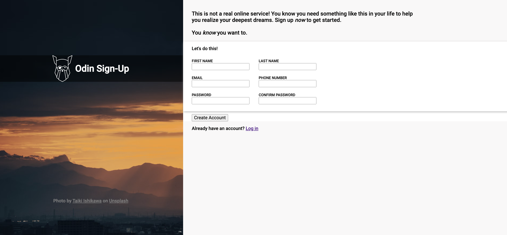
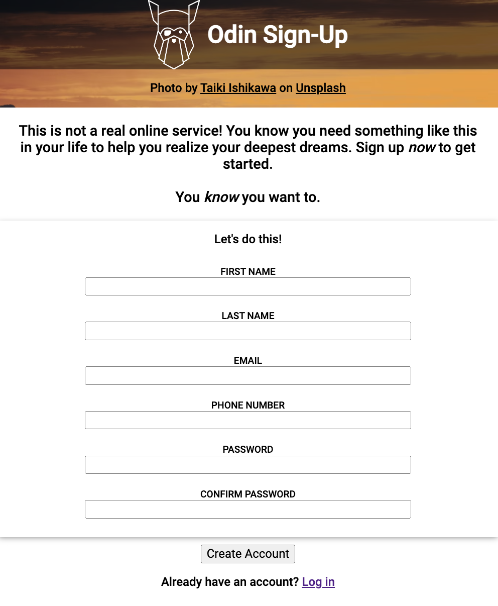

# odin-sign-up
Live Site: [Odin Sign Up Form](https://kaykaym01.github.io/odin-sign-up/)

Challenge Description: [The Odin Project: Odin Sign Up](https://www.theodinproject.com/lessons/node-path-intermediate-html-and-css-sign-up-form)

This project is a part of FreeCodeCamp's Responsive Web Design course. The challenge is to create a tribute page similar to this: [Template Sign Up Form](https://cdn.statically.io/gh/TheOdinProject/curriculum/5f37d43908ef92499e95a9b90fc3cc291a95014c/html_css/project-sign-up-form/sign-up-form.png)

Desktop Screenshot:

Mobile Screenshot:

Skills Demonstrated:
* Responsive Web Design
* Mobile-First Design
* HTML Forms
* Styling Forms 
* normalize.css applied
